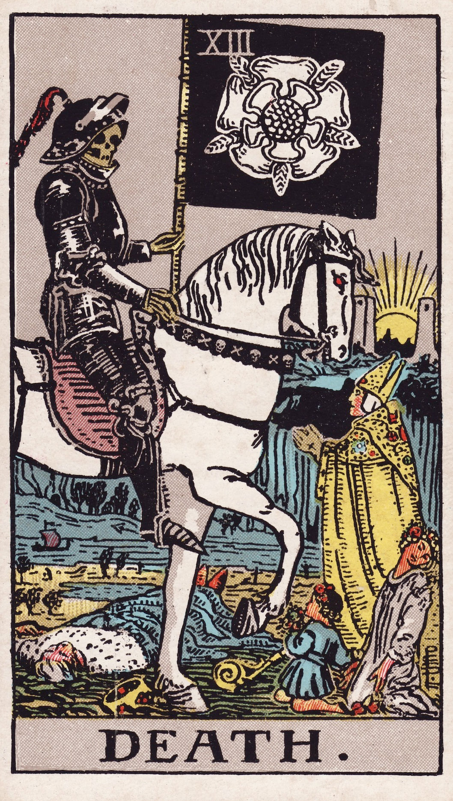

[](https://jappieklooster.nl/tag/haskell.html)
[](https://discord.gg/Hp4agqy)

> Death (XIII) Symbolizes significant change, transformation, and endings, rather than literal physical death.

Death to typeclasses.

In here we explore an alternative universe where
we neglect the existence of typeclasses in favor of the backpack module system.
This ends up doing ocaml in haskell.
It's either best of both worlds, 
or a failed experiment.

🐫🐫🐫



💀💀💀

Actually it worked! ✨

Hmm, although I'd probably not replace the Functor/Applicative/Monad
typeclassess like I did here,
that's just for shock and awe.
It ends up being a lot of work for little gain,
While backpack is compatible with typeclasses,
you can just start encoding the effects you want. (which is all the effects-*) 
in this example.


### Tools
Enter the nix shell.
```
nix develop
```
You can checkout the makefile to see what's available:
```
cat makefile
```

### Running
```
make run
```

### Fast filewatch which runs tests
```
make ghcid
```
